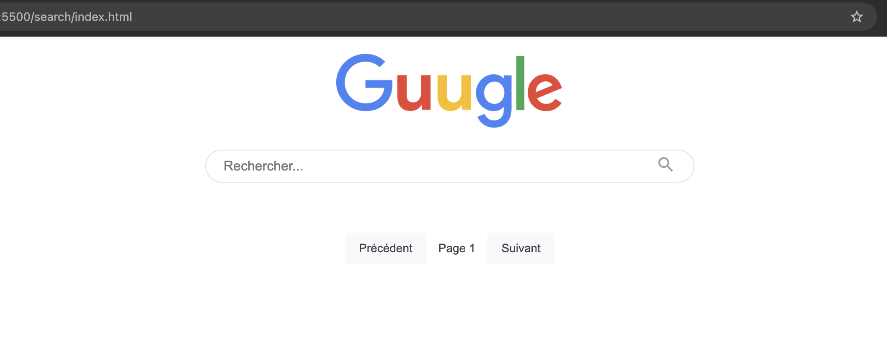

# Guugle Search Engine

A sophisticated web search engine developed in Python, combining web crawling, indexing, and semantic search.

## 🎯 Project Objective

Guugle is an educational implementation that reproduces the fundamental mechanisms of Google Search. This project aims to understand and implement the key concepts that make modern search engines successful:

- **Intelligent Crawling**: Like Google, Guugle crawls the web ethically by respecting website rules and intelligently managing resources.
- **Advanced Indexing**: The system uses techniques similar to Google's, such as TF-IDF and semantic analysis, to understand and classify page content.
- **PageRank**: The implementation of Google's PageRank algorithm measures the relative importance of web pages.
- **Semantic Search**: Through BERT, Guugle understands the context and intent behind queries, just like Google does.

This project is an excellent resource for understanding the fundamental principles of search engines and the architecture of large-scale web search systems.

## 🚀 Features

- **Intelligent Web Crawling**
  - Respect for robots.txt rules
  - Request delay management
  - Crawling depth limitation
  - Multilingual support (French and English)

- **Advanced Indexing**
  - Inverted index with TF-IDF
  - Semantic vectors with BERT
  - Automatic page categorization
  - PageRank calculation

- **Search API**
  - Keyword-based search
  - Combined scoring (TF-IDF, semantic similarity, PageRank)
  - Category filtering
  - Result limit control

## 🛠️ Technologies Used

- **Backend**
  - FastAPI for REST API
  - SQLite for data storage
  - BeautifulSoup4 for HTML parsing
  - NLTK for natural language processing
  - BERT for semantic analysis
  - scikit-learn for categorization

- **Main Dependencies**
  - aiohttp for asynchronous crawling
  - transformers for BERT
  - numpy and scipy for calculations
  - networkx for PageRank

## 📦 Installation

1. Clone the repository:
```bash
git clone https://github.com/garciamathias/search-engine
cd search-engine
```

2. Install dependencies:
```bash
python install_dependencies.py
```

## 🚀 Usage

1. **Launch the Crawler**
```bash
python crawler.py
```

2. **Start the API**
```bash
python api.py
```

The API will be accessible at: `http://localhost:8000`

## 🔍 API Endpoints

### Search
```
GET /search?query=<search_term>&limit=<number_of_results>
```

### Categories
```
GET /categories
```

## 📊 Database Structure

- **pages**: Storage of crawled web pages
- **inverted_index**: Inverted index for search
- **links**: Graph of links between pages
- **pagerank**: PageRank scores of pages
- **queue**: Crawling queue
